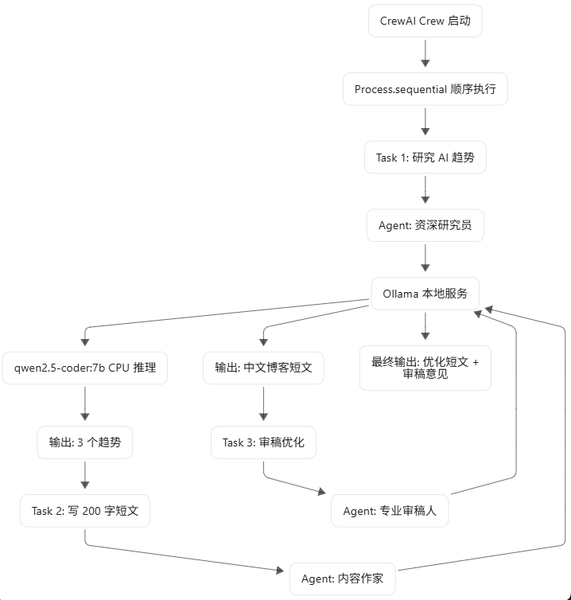

# CrewAI + Ollama 本地 LLM Demo

这是一个在 WSL 中运行的 CrewAI demo，用本地 Ollama 模型 `qwen2.5-coder:7b` 展示三个智能体如何按顺序协作完成一篇中文短文。

演示流程：

```text
研究员 -> 作家 -> 审稿人
```

这个 demo 的重点不是展示单次大模型问答，而是展示 CrewAI 如何把一个目标拆成多个角色、多个任务，并通过 `Process.sequential` 串成一个可观察的工作流。

## Demo 目的

本项目用于演示三个核心问题：

1. CrewAI 如何把不同职责封装成 `Agent`。
2. CrewAI 如何用 `Task` 描述每个智能体要完成的工作。
3. CrewAI 如何用 `Crew` 组织多个智能体和任务。
4. CrewAI 如何通过 `Process.sequential` 让任务按顺序执行，并把前一步输出传递给后一步。

在这个例子里，Ollama 提供本地 LLM 推理能力，CrewAI 负责多智能体编排：

```text
CrewAI: 负责角色、任务、流程编排
Ollama: 负责本地模型服务
qwen2.5-coder:7b: 负责实际文本生成
```

## Code Structure

当前项目的核心代码结构如下。这里展示的是适合讲解和维护的 source-focused 结构；`.env`、`.venv/`、`__pycache__/` 属于本地环境或运行生成内容，不作为核心代码结构展示。

```text
crewai-ollama-demo/
├── README.md
├── requirements.txt
├── .env.example
├── .gitignore
├── main.py
└── src/
    ├── __init__.py
    ├── agents.py
    ├── crew.py
    ├── llm_config.py
    ├── monitoring.py
    ├── tasks.py
    └── validation.py
```

文件职责：

```text
main.py              启动入口，打印 demo 信息，执行 crew.kickoff()，并输出最终结果与校验报告
src/llm_config.py    配置本地 Ollama LLM，例如 ollama/qwen2.5-coder:7b
src/agents.py        定义研究员、作家、审稿人三个 Agent
src/tasks.py         定义研究、写作、审稿三个 Task，以及每一步的输出要求
src/crew.py          组装 Agent 和 Task，创建 Crew，并指定 Process.sequential
src/monitoring.py    记录每次 LLM 调用的开始、结束和耗时，用于观察 demo 执行过程
src/validation.py    对最终输出做后处理校验，例如是否存在最终版本、段落数和审稿意见
requirements.txt     Python 依赖
.env.example         环境变量样例，包含 Ollama 地址和模型名
.gitignore           忽略虚拟环境、缓存和本地环境文件
README.md            Demo 说明、运行步骤和结果分析
```

## CrewAI 核心概念

### 1. Agent

`Agent` 是智能体，也就是团队成员。

本 demo 中有三个智能体：

```text
资深研究员: 负责整理 AI 趋势
内容作家: 负责根据研究结果写中文短文
专业审稿人: 负责审阅、改写和输出最终版本
```

每个 Agent 都有自己的 `role`、`goal`、`backstory`，并且都使用同一个本地 LLM：

```python
llm=local_llm
```

关键理解：`Agent` 不是模型本身，而是基于模型创建出来的工作角色。

### 2. Task

`Task` 是分配给某个 Agent 的具体工作。

本 demo 中有三个任务：

```text
research_task: 研究 AI 在 2026 年的趋势
writing_task: 根据研究结果写 180-220 字中文短文
review_task: 审阅文章，检查表达、结构和事实风险，并输出最终优化版本
```

关键理解：`Task` 定义“要做什么”，`Agent` 定义“谁来做”。

### 3. Crew

`Crew` 是团队容器，用来把多个 Agent 和多个 Task 组织起来。

```python
content_crew = Crew(
    agents=[researcher, writer, reviewer],
    tasks=[research_task, writing_task, review_task],
    process=Process.sequential,
    verbose=True,
)
```

关键理解：`Crew` 是整个多智能体工作流的入口，调用 `crew.kickoff()` 后，CrewAI 开始执行任务链。

### 4. Process.sequential

`Process.sequential` 表示任务按顺序执行。

本 demo 的顺序是：

```text
research_task -> writing_task -> review_task
```

也就是：

```text
研究员先输出研究结果
作家基于研究结果写文章
审稿人基于文章进行审阅和优化
```

关键理解：这不是三个互不相关的 prompt，而是一条连续的内容生产流水线。

## WSL 运行步骤

进入项目目录：

```bash
cd ~/projects/crewai-ollama-demo
```

创建并激活虚拟环境：

```bash
python3 -m venv .venv
source .venv/bin/activate
```

安装依赖：

```bash
pip install --upgrade pip
pip install -r requirements.txt
```

创建环境变量文件：

```bash
cp .env.example .env
```

确认 Ollama 服务可访问：

```bash
curl http://localhost:11434/
```

如果看到下面输出，说明 Ollama 正在运行：

```text
Ollama is running
```

确认本地模型存在：

```bash
ollama list
```

期望看到：

```text
qwen2.5-coder:7b
```

建议在正式 demo 前预热一次模型：

```bash
ollama run qwen2.5-coder:7b "用中文说一句你好"
```

运行 demo：

```bash
python main.py
```

## 整体工作流




## 本次运行结果摘要

根据本次运行输出，CrewAI 成功完成了完整的三步顺序流程：

```text
Crew Execution Started
Task 1 Started -> Agent: 资深研究员 -> Agent Final Answer
Task 2 Started -> Agent: 内容作家 -> Agent Final Answer
Task 3 Started -> Agent: 专业审稿人 -> Agent Final Answer
Crew Execution Completed
```

最终输出包含两部分：

```text
最终优化版本
审稿意见
```

审稿意见包括：

```text
1. 删除过强表达。
2. 简化句子，使表达更自然。
3. 调整句式，提高句子清晰度。
```

这说明 `review_task` 不只是生成一段新文本，也尝试执行了“审阅 + 修改说明”的职责。

## 运行结果中的 CrewAI 原理分析

### 1. Agent 分工是清楚的

运行日志中可以看到三个 Agent 被依次启动：

```text
Agent: 资深研究员
Agent: 内容作家
Agent: 专业审稿人
```

这证明 CrewAI 没有把任务混成一次普通问答，而是让不同角色分别承担不同阶段的工作。

### 2. Task 控制了每一步的目标

每次 `Task Started` 都打印了当前任务描述。比如研究任务要求输出 3 个趋势，写作任务要求写 180-220 字中文短文，审稿任务要求输出最终优化版本和审稿意见。

这体现了 CrewAI 的任务驱动模式：

```text
Agent 提供角色能力
Task 提供具体目标和输出约束
```

### 3. Process.sequential 生效了

从日志顺序可以看到，任务不是并发执行，而是按下面顺序完成：

```text
研究 -> 写作 -> 审稿
```

这正是 `Process.sequential` 的效果。它适合演示“流水线式”工作，例如内容生产、报告生成、需求分析、代码审查等。

### 4. Crew 是整个流程的协调者

日志中的 `Crew Execution Started` 和 `Crew Execution Completed` 表明，`Crew` 负责管理整个执行生命周期。

可以把它理解成一个轻量的项目经理：

```text
Crew 决定有哪些成员
Crew 知道有哪些任务
Crew 按指定流程推动任务执行
Crew 最后汇总最终输出
```

### 5. 本地 LLM 可以支撑完整多智能体流程

本次运行使用的是 Ollama 中的 `qwen2.5-coder:7b`。三个 Agent 都调用同一个本地模型，但因为角色、目标和任务不同，表现出了不同的工作行为。

这也是 demo 的关键结论：

```text
同一个 LLM + 不同 Agent 定义 + 不同 Task = 多角色协作效果
```

## 后处理校验观察

本项目在 CrewAI 执行完成后，还加入了一个简单的后处理校验，用来检查最终输出是否符合 demo 要求。

本次运行结果显示：

```text
[PASS] 最终优化版本存在
[FAIL] 中文字数 180-220: 当前中文字数=389
[FAIL] 最终版本分为 3 段: 当前段落数=4
[PASS] 禁用/过强表达检查
[PASS] 审稿意见存在
[PASS] 审稿意见落实检查
```

这个结果很适合用于 demo 讲解，因为它说明了一个真实现象：

```text
LLM 可以理解任务，但不一定每次都严格满足格式和字数约束。
```

因此，在真实应用中，CrewAI 的输出最好配合后处理校验、自动重试或更严格的结构化输出机制。

## Demo 讲解建议

现场演示时可以按下面顺序讲：

1. 先介绍目标：用本地 LLM 搭建一个内容生产团队。
2. 展示 `src/agents.py`：说明三个 Agent 的角色分工。
3. 展示 `src/tasks.py`：说明每个 Task 的输入目标和输出要求。
4. 展示 `src/crew.py`：说明 `Crew` 如何把 Agent、Task 和 `Process.sequential` 组合起来。
5. 运行 `python main.py`：观察三个 Agent 按顺序执行。
6. 讲解最终输出：研究员产出趋势，作家生成短文，审稿人输出优化版本和审稿意见。
7. 讲解校验报告：说明多智能体流程能完成任务，但生产级应用还需要校验机制。

## 一句话总结

这个 demo 展示了 CrewAI 的核心价值：它把一次普通的大模型生成，组织成了一个有角色分工、有任务顺序、有最终校验的本地多智能体工作流。
